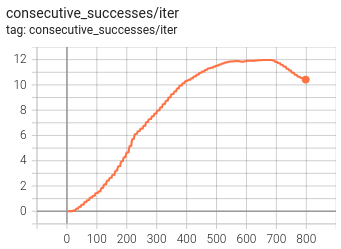
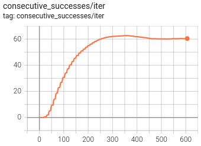
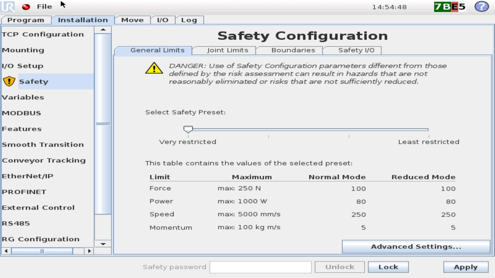
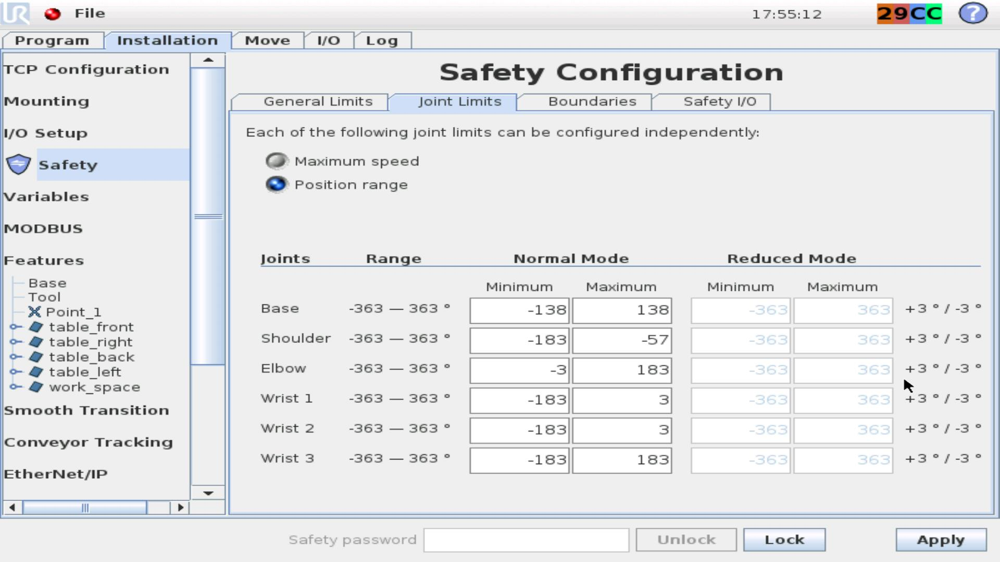
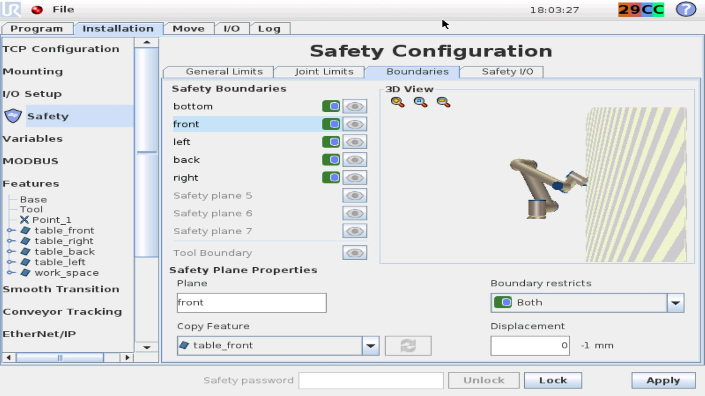
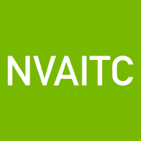

# UR10 Reacher Reinforcement Learning Sim2Real Environment for Omniverse Isaac Gym/Sim

This repository adds a UR10Reacher environment based on [OmniIsaacGymEnvs](https://github.com/NVIDIA-Omniverse/OmniIsaacGymEnvs) (commit [d0eaf2e](https://github.com/NVIDIA-Omniverse/OmniIsaacGymEnvs/tree/d0eaf2e7f1e1e901d62e780392ca77843c08eb2c)), and includes Sim2Real code to control a real-world [UR10](https://www.universal-robots.com/products/ur10-robot/) with the policy learned by reinforcement learning in Omniverse Isaac Gym/Sim.

We target Isaac Sim 2022.1.1 and tested the RL code on Windows 10 and Ubuntu 18.04. The Sim2Real code is tested on Linux and a real UR5 CB3 (since we don't have access to a real UR10).

This repo is compatible with [OmniIsaacGymEnvs-DofbotReacher](https://github.com/j3soon/OmniIsaacGymEnvs-DofbotReacher).

## Preview


## Installation

Prerequisites:
- Before starting, please make sure your hardware and software meet the [system requirements](https://docs.omniverse.nvidia.com/isaacsim/latest/installation/requirements.html#system-requirements).
- [Install Omniverse Isaac Sim 2022.1.1](https://docs.omniverse.nvidia.com/isaacsim/latest/installation/install_workstation.html) (Must setup Cache and Nucleus)
  - You may try out newer versions of Isaac Sim along with [their corresponding patch](https://github.com/j3soon/isaac-extended#conda-issue-on-linux), but it is not guaranteed to work.
- Double check that Nucleus is correctly installed by [following these steps](https://github.com/j3soon/isaac-extended#nucleus).
- Your computer & GPU should be able to run the Cartpole example in [OmniIsaacGymEnvs](https://github.com/NVIDIA-Omniverse/OmniIsaacGymEnvs)
- (Optional) [Set up a UR3/UR5/UR10](https://www.universal-robots.com/products/) in the real world

Make sure to install Isaac Sim in the default directory and clone this repository to the home directory. Otherwise, you will encounter issues if you didn't modify the commands below accordingly.

We will use Anaconda to manage our virtual environment:

1. Clone this repository:
   - Linux
     ```sh
     cd ~
     git clone https://github.com/j3soon/OmniIsaacGymEnvs-UR10Reacher.git
     ```
   - Windows
     ```sh
     cd %USERPROFILE%
     git clone https://github.com/j3soon/OmniIsaacGymEnvs-UR10Reacher.git
     ```
2. Generate [instanceable](https://docs.omniverse.nvidia.com/isaacsim/latest/isaac_gym_tutorials/tutorial_gym_instanceable_assets.html) UR10 assets for training:

   [Launch the Script Editor](https://docs.omniverse.nvidia.com/app_isaacsim/app_isaacsim/tutorial_gui_interactive_scripting.html#script-editor) in Isaac Sim. Copy the content in `omniisaacgymenvs/utils/usd_utils/create_instanceable_ur10.py` and execute it inside the Script Editor window. Wait until you see the text `Done!`.
3. (Optional) [Install ROS Melodic for Ubuntu](https://wiki.ros.org/melodic/Installation/Ubuntu) and [Set up a catkin workspace for UR10](https://github.com/UniversalRobots/Universal_Robots_ROS_Driver/blob/master/README.md).
   
   Please change all `catkin_ws` in the commands to `ur_ws`, and make sure you can control the robot with `rqt-joint-trajectory-controller`.

   ROS support is not tested on Windows.
4. [Download and Install Anaconda](https://www.anaconda.com/products/distribution#Downloads).
   ```sh
   # For 64-bit Linux (x86_64/x64/amd64/intel64)
   wget https://repo.anaconda.com/archive/Anaconda3-2022.10-Linux-x86_64.sh
   bash Anaconda3-2022.10-Linux-x86_64.sh
   ```
   For Windows users, make sure to use `Anaconda Prompt` instead of `Anaconda Powershell Prompt`, `Command Prompt`, or `Powershell` for the following commands.
5. Patch Isaac Sim 2022.1.1
   - Linux
     ```sh
     export ISAAC_SIM="$HOME/.local/share/ov/pkg/isaac_sim-2022.1.1"
     cp $ISAAC_SIM/setup_python_env.sh $ISAAC_SIM/setup_python_env.sh.bak
     cp ~/OmniIsaacGymEnvs-UR10Reacher/isaac_sim-2022.1.1-patch/setup_python_env.sh $ISAAC_SIM/setup_python_env.sh
     ```
   - Windows
     ```sh
     set ISAAC_SIM="%LOCALAPPDATA%\ov\pkg\isaac_sim-2022.1.1"
     copy %USERPROFILE%\OmniIsaacGymEnvs-UR10Reacher\isaac_sim-2022.1.1-patch\windows\setup_conda_env.bat %ISAAC_SIM%\setup_conda_env.bat
     ```
6. [Set up conda environment for Isaac Sim](https://docs.omniverse.nvidia.com/isaacsim/latest/installation/install_python.html#advanced-running-with-anaconda)
   - Linux
     ```sh
     # conda remove --name isaac-sim --all
     export ISAAC_SIM="$HOME/.local/share/ov/pkg/isaac_sim-2022.1.1"
     cd $ISAAC_SIM
     conda env create -f environment.yml
     conda activate isaac-sim
     cd ~/OmniIsaacGymEnvs-UR10Reacher
     pip install -e .
     # Below is optional
     pip install pyyaml rospkg
     ```
   - Windows
     ```sh
     # conda remove --name isaac-sim --all
     set ISAAC_SIM="%LOCALAPPDATA%\ov\pkg\isaac_sim-2022.1.1"
     cd %ISAAC_SIM%
     conda env create -f environment.yml
     conda activate isaac-sim
     :: Fix incorrect importlib-metadata version (isaac-sim 2022.1.1)
     pip install importlib-metadata==4.11.4
     cd %USERPROFILE%\OmniIsaacGymEnvs-UR10Reacher
     pip install -e .
     :: Fix incorrect torch version (isaac-sim 2022.1.1)
     conda install -y pytorch==1.11.0 torchvision==0.12.0 torchaudio==0.11.0 -c pytorch
     ```
7. Activate conda & ROS environment
   - Linux
     ```sh
     export ISAAC_SIM="$HOME/.local/share/ov/pkg/isaac_sim-2022.1.1"
     cd $ISAAC_SIM
     conda activate isaac-sim
     source setup_conda_env.sh
     # Below are optional
     cd ~/ur_ws
     source devel/setup.bash # or setup.zsh if you're using zsh
     ```
   - Windows
     ```sh
     set ISAAC_SIM="%LOCALAPPDATA%\ov\pkg\isaac_sim-2022.1.1"
     cd %ISAAC_SIM%
     conda activate isaac-sim
     call setup_conda_env.bat
     ```

Please note that you should execute the commands in Step 7 for every new shell.

For Windows users, replace `~` to `%USERPROFILE%` for all the following commands.

## Dummy Policy

This is a sample to make sure you have setup the environment correctly. You should see a single UR10 in Isaac Sim.

```sh
cd ~/OmniIsaacGymEnvs-UR10Reacher
python omniisaacgymenvs/scripts/dummy_ur10_policy.py task=UR10Reacher test=True num_envs=1
```

## Training

You can launch the training in `headless` mode as follows:

```sh
cd ~/OmniIsaacGymEnvs-UR10Reacher
python omniisaacgymenvs/scripts/rlgames_train.py task=UR10Reacher headless=True
```

The number of environments is set to 512 by default. If your GPU has small memory, you can decrease the number of environments by changing the arguments `num_envs` as below:

```sh
cd ~/OmniIsaacGymEnvs-UR10Reacher
python omniisaacgymenvs/scripts/rlgames_train.py task=UR10Reacher headless=True num_envs=512
```

You can also skip training by downloading the pre-trained model checkpoint by:

```sh
cd ~/OmniIsaacGymEnvs-UR10Reacher
wget https://github.com/j3soon/OmniIsaacGymEnvs-UR10Reacher/releases/download/v1.0.0/runs.zip
unzip runs.zip
# For Sim2Real only, requires editing config file as mentioned in the Sim2Real section
wget https://github.com/j3soon/OmniIsaacGymEnvs-UR10Reacher/releases/download/v1.0.0/runs_safety.zip
unzip runs_safety.zip
```

The learning curve of the pre-trained model (normal vs. safety):




## Testing

Make sure you have model checkpoints at `~/OmniIsaacGymEnvs-UR10Reacher/runs`, you can check it with the following command:

```sh
ls ~/OmniIsaacGymEnvs-UR10Reacher/runs/UR10Reacher/nn/
```

You can visualize the learned policy by the following command:

```sh
cd ~/OmniIsaacGymEnvs-UR10Reacher
python omniisaacgymenvs/scripts/rlgames_train.py task=UR10Reacher test=True num_envs=512 checkpoint=./runs/UR10Reacher/nn/UR10Reacher.pth
```

Likewise, you can decrease the number of environments by modifying the parameter `num_envs=512`.

## Sim2Real

It is important to make sure that you know how to safely control your robot by reading the manual. For additional safety, please add the following configurations:
1. Set `General Limits` to `Very restricted`
   
2. Set `Joint Limits` according to your robot mounting point and the environment.
   
3. Set `Boundaries` according to the robot's environment.
   

Play with the robot and make sure it won't hit anything under the current configuration. If anything goes wrong, press the red `EMERGENCY-STOP` button.

In the following, we'll assume you have the same mounting direction and workspace as the preview GIF. If you have a different setup, you need to modify the code. Please [open an issue](https://github.com/j3soon/OmniIsaacGymEnvs-UR10Reacher/issues) if you need more information on where to modify.

We'll use ROS to control the real-world robot. Run the following command in a Terminal: (Replace `192.168.50.50` to your robot's IP address)

```sh
roslaunch ur_robot_driver ur5_bringup.launch robot_ip:=192.168.50.50 headless_mode:=true
```

Edit `omniisaacgymenvs/cfg/task/UR10Reacher.yaml`. Set `sim2real.enabled` and `safety.enabled` to `True`:

```yaml
sim2real:
  enabled: True
  fail_quietely: False
  verbose: False
safety: # Reduce joint limits during both training & testing
  enabled: True
```

Now you can control the real-world UR10 in real-time by the following command:

```sh
cd ~/OmniIsaacGymEnvs-UR10Reacher
python omniisaacgymenvs/scripts/rlgames_train.py task=UR10Reacher test=True num_envs=1 checkpoint=./runs/UR10Reacher/nn/UR10Reacher.pth
# or if you want to use the pre-trained checkpoint
python omniisaacgymenvs/scripts/rlgames_train.py task=UR10Reacher test=True num_envs=1 checkpoint=./runs_safety/UR10Reacher/nn/UR10Reacher.pth
```

## Demo

We provide an interactable demo based on the `UR10Reacher` RL example. In this demo, you can click on any of
the UR10 in the scene to manually control the robot with your keyboard as follows:

- `Q`/`A`: Control Joint 0.
- `W`/`S`: Control Joint 1.
- `E`/`D`: Control Joint 2.
- `R`/`F`: Control Joint 3.
- `T`/`G`: Control Joint 4.
- `Y`/`H`: Control Joint 5.
- `ESC`: Unselect a selected UR10 and yields manual control

Launch this demo with the following command. Note that this demo limits the maximum number of UR10 in the scene to 128.

```sh
cd ~/OmniIsaacGymEnvs-UR10Reacher
python omniisaacgymenvs/scripts/rlgames_play.py task=UR10Reacher num_envs=64
```

## Running in Docker

If you have a [NVIDIA Enterprise subscription](https://docs.omniverse.nvidia.com/prod_nucleus/prod_nucleus/enterprise/installation/planning.html), you can run all services with Docker Compose.

For users without a subscription, you can pull the [Isaac Docker image](https://catalog.ngc.nvidia.com/orgs/nvidia/containers/isaac-sim), but should still install Omniverse Nucleus beforehand. (only Isaac itself is dockerized)

Follow [this tutorial](https://docs.omniverse.nvidia.com/isaacsim/latest/installation/install_container.html#isaac-sim-setup-remote-headless-container) to generate your NGC API Key, and make sure you can access Isaac with Omniverse Streaming Client, WebRTC, or WebSocket. After that, exit the Docker container.

Please note that you should generate instanceable assets beforehand as mentioned in the [Installation](#installation) section.

We will now set up the environment inside Docker:

1. Launch an Isaac Container:
   ```sh
   docker run --name isaac-sim --entrypoint bash -it --gpus all -e "ACCEPT_EULA=Y" --rm --network=host \
   -v ~/docker/isaac-sim/cache/ov:/root/.cache/ov:rw \
   -v ~/docker/isaac-sim/cache/pip:/root/.cache/pip:rw \
   -v ~/docker/isaac-sim/cache/glcache:/root/.cache/nvidia/GLCache:rw \
   -v ~/docker/isaac-sim/cache/computecache:/root/.nv/ComputeCache:rw \
   -v ~/docker/isaac-sim/logs:/root/.nvidia-omniverse/logs:rw \
   -v ~/docker/isaac-sim/config:/root/.nvidia-omniverse/config:rw \
   -v ~/docker/isaac-sim/data:/root/.local/share/ov/data:rw \
   -v ~/docker/isaac-sim/documents:/root/Documents:rw \
   nvcr.io/nvidia/isaac-sim:2022.1.1
   ```
2. Install common tools:
   ```sh
   apt update && apt install -y git wget vim
   ```
3. Clone this repository:
   ```sh
   cd ~
   git clone https://github.com/j3soon/OmniIsaacGymEnvs-UR10Reacher.git
   ```
4. [Download and Install Anaconda](https://www.anaconda.com/products/distribution#Downloads).
   ```sh
   # For 64-bit (x86_64/x64/amd64/intel64)
   wget https://repo.anaconda.com/archive/Anaconda3-2022.10-Linux-x86_64.sh
   bash Anaconda3-2022.10-Linux-x86_64.sh -b -p $HOME/anaconda3
   ```
5. Patch Isaac Sim 2022.1.1
   ```sh
   export ISAAC_SIM="/isaac-sim"
   cp $ISAAC_SIM/setup_python_env.sh $ISAAC_SIM/setup_python_env.sh.bak
   cp ~/OmniIsaacGymEnvs-UR10Reacher/isaac_sim-2022.1.1-patch/setup_python_env.sh $ISAAC_SIM/setup_python_env.sh
   ```
6. [Set up conda environment for Isaac Sim](https://docs.omniverse.nvidia.com/isaacsim/latest/installation/install_python.html#advanced-running-with-anaconda)
   ```sh
   source ~/anaconda3/etc/profile.d/conda.sh
   # conda remove --name isaac-sim --all
   export ISAAC_SIM="/isaac-sim"
   cd $ISAAC_SIM
   conda env create -f environment.yml
   conda activate isaac-sim
   cd ~/OmniIsaacGymEnvs-UR10Reacher
   pip install -e .
   ```
7. Activate conda environment
   ```sh
   source ~/anaconda3/etc/profile.d/conda.sh
   export ISAAC_SIM="/isaac-sim"
   cd $ISAAC_SIM
   conda activate isaac-sim
   source setup_conda_env.sh
   ./vulkan_check.sh
   ```

We can now train a RL policy in this container:

```sh
cd ~/OmniIsaacGymEnvs-UR10Reacher
python omniisaacgymenvs/scripts/rlgames_train.py task=UR10Reacher headless=True num_envs=512
```

Make sure to copy the learned weights to a mounted volume before exiting the container, otherwise it will be deleted:

```sh
# In container
cp -r ~/OmniIsaacGymEnvs-UR10Reacher/runs ~/Documents/runs
# In host
ls ~/docker/isaac-sim/documents/
```

You can watch the training progress with:

```sh
docker ps # Observe Container ID
docker exec -it <CONTAINER_ID> /bin/bash
conda activate isaac-sim
cd ~/OmniIsaacGymEnvs-UR10Reacher
tensorboard --logdir=./runs
```

Currently we do not support running commands that requires visualization (Testing, Sim2Real, etc.) in Docker. Since I haven't figured out how to make Vulkan render a Isaac window inside a container yet. Alternatively, it may be possible to add `headless=True` and view them in Omniverse Streaming Client, WebRTC, or WebSocket, but I haven't tested this by myself.

## Acknowledgement

This project has been made possible through the support of [ElsaLab][elsalab] and [NVIDIA AI Technology Center (NVAITC)][nvaitc].

I would also like to express my gratitude to [@tony2guo](https://github.com/tony2guo) for his invaluable assistance in guiding me through the setup process of the real-world UR10.

For a complete list of contributors to the code of this repository, please visit the [contributor list](https://github.com/j3soon/OmniIsaacGymEnvs-UR10Reacher/graphs/contributors).

[][elsalab]
[][nvaitc]

[elsalab]: https://github.com/elsa-lab
[nvaitc]: https://github.com/NVAITC

Disclaimer: this is not an official NVIDIA product.

> **Note**: below are the original README of [OmniIsaacGymEnvs](https://github.com/NVIDIA-Omniverse/OmniIsaacGymEnvs).

# Omniverse Isaac Gym Reinforcement Learning Environments for Isaac Sim

## About this repository

This repository contains Reinforcement Learning examples that can be run with the latest release of [Isaac Sim](https://docs.omniverse.nvidia.com/app_isaacsim/app_isaacsim/overview.html). RL examples are trained using PPO from [rl_games](https://github.com/Denys88/rl_games) library and examples are built on top of Isaac Sim's `omni.isaac.core` and `omni.isaac.gym` frameworks.

Please see [release notes](docs/release_notes.md) for the latest updates.

&emsp;

&emsp;

&emsp;

&emsp;

&emsp;


## Installation

Follow the Isaac Sim [documentation](https://docs.omniverse.nvidia.com/isaacsim/latest/installation/install_workstation.html) to install the latest Isaac Sim release. 

*Examples in this repository rely on features from the most recent Isaac Sim release. Please make sure to update any existing Isaac Sim build to the latest release version, 2023.1.0, to ensure examples work as expected.*

Note that the 2022.2.1 OmniIsaacGymEnvs release will no longer work with the latest Isaac Sim 2023.1.0 release. Due to a change in USD APIs, line 138 in rl_task.py is no longer valid. To run the previous OIGE release with the latest Isaac Sim release, please comment out lines 137 and 138 in rl_task.py or set `add_distant_light` to `False` in the task config file. No changes are required if running with the latest release of OmniIsaacGymEnvs.

Once installed, this repository can be used as a python module, `omniisaacgymenvs`, with the python executable provided in Isaac Sim.

To install `omniisaacgymenvs`, first clone this repository:

```bash
git clone https://github.com/NVIDIA-Omniverse/OmniIsaacGymEnvs.git
```

Once cloned, locate the [python executable in Isaac Sim](https://docs.omniverse.nvidia.com/isaacsim/latest/installation/install_python.html). By default, this should be `python.sh`. We will refer to this path as `PYTHON_PATH`.

To set a `PYTHON_PATH` variable in the terminal that links to the python executable, we can run a command that resembles the following. Make sure to update the paths to your local path.

```
For Linux: alias PYTHON_PATH=~/.local/share/ov/pkg/isaac_sim-*/python.sh
For Windows: doskey PYTHON_PATH=C:\Users\user\AppData\Local\ov\pkg\isaac_sim-*\python.bat $*
For IsaacSim Docker: alias PYTHON_PATH=/isaac-sim/python.sh
```

Install `omniisaacgymenvs` as a python module for `PYTHON_PATH`:

```bash
PYTHON_PATH -m pip install -e .
```

The following error may appear during the initial installation. This error is harmless and can be ignored.

```
ERROR: pip's dependency resolver does not currently take into account all the packages that are installed. This behaviour is the source of the following dependency conflicts.
```


### Running the examples

*Note: All commands should be executed from `OmniIsaacGymEnvs/omniisaacgymenvs`.*

To train your first policy, run:

```bash
PYTHON_PATH scripts/rlgames_train.py task=Cartpole
```

An Isaac Sim app window should be launched. Once Isaac Sim initialization completes, the Cartpole scene will be constructed and simulation will start running automatically. The process will terminate once training finishes.

Note that by default, we show a Viewport window with rendering, which slows down training. You can choose to close the Viewport window during training for better performance. The Viewport window can be re-enabled by selecting `Window > Viewport` from the top menu bar.

To achieve maximum performance, launch training in `headless` mode as follows:

```bash
PYTHON_PATH scripts/rlgames_train.py task=Ant headless=True
```

#### A Note on the Startup Time of the Simulation

Some of the examples could take a few minutes to load because the startup time scales based on the number of environments. The startup time will continually
be optimized in future releases.

### Extension Workflow

The extension workflow provides a simple user interface for creating and launching RL tasks. To launch Isaac Sim for the extension workflow, run:

```bash
./<isaac_sim_root>/isaac-sim.gym.sh --ext-folder </parent/directory/to/OIGE>
```

Note: `isaac_sim_root` should be located in the same directory as `python.sh`.

The UI window can be activated from `Isaac Examples > RL Examples` by navigating the top menu bar.
For more details on the extension workflow, please refer to the [documentation](docs/extension_workflow.md).

### Loading trained models // Checkpoints

Checkpoints are saved in the folder `runs/EXPERIMENT_NAME/nn` where `EXPERIMENT_NAME`
defaults to the task name, but can also be overridden via the `experiment` argument.

To load a trained checkpoint and continue training, use the `checkpoint` argument:

```bash
PYTHON_PATH scripts/rlgames_train.py task=Ant checkpoint=runs/Ant/nn/Ant.pth
```

To load a trained checkpoint and only perform inference (no training), pass `test=True`
as an argument, along with the checkpoint name. To avoid rendering overhead, you may
also want to run with fewer environments using `num_envs=64`:

```bash
PYTHON_PATH scripts/rlgames_train.py task=Ant checkpoint=runs/Ant/nn/Ant.pth test=True num_envs=64
```

Note that if there are special characters such as `[` or `=` in the checkpoint names,
you will need to escape them and put quotes around the string. For example,
`checkpoint="runs/Ant/nn/last_Antep\=501rew\[5981.31\].pth"`

We provide pre-trained checkpoints on the [Nucleus](https://docs.omniverse.nvidia.com/nucleus/latest/index.html) server under `Assets/Isaac/2023.1.0/Isaac/Samples/OmniIsaacGymEnvs/Checkpoints`. Run the following command
to launch inference with pre-trained checkpoint:

Localhost (To set up localhost, please refer to the [Isaac Sim installation guide](https://docs.omniverse.nvidia.com/isaacsim/latest/installation/install_workstation.html)):

```bash
PYTHON_PATH scripts/rlgames_train.py task=Ant checkpoint=omniverse://localhost/NVIDIA/Assets/Isaac/2023.1.0/Isaac/Samples/OmniIsaacGymEnvs/Checkpoints/ant.pth test=True num_envs=64
```

Production server:

```bash
PYTHON_PATH scripts/rlgames_train.py task=Ant checkpoint=http://omniverse-content-production.s3-us-west-2.amazonaws.com/Assets/Isaac/2023.1.0/Isaac/Samples/OmniIsaacGymEnvs/Checkpoints/ant.pth test=True num_envs=64
```

When running with a pre-trained checkpoint for the first time, we will automatically download the checkpoint file to `omniisaacgymenvs/checkpoints`. For subsequent runs, we will re-use the file that has already been downloaded, and will not overwrite existing checkpoints with the same name in the `checkpoints` folder.

## Runing from Docker

Latest Isaac Sim Docker image can be found on [NGC](https://catalog.ngc.nvidia.com/orgs/nvidia/containers/isaac-sim). A utility script is provided at `docker/run_docker.sh` to help initialize this repository and launch the Isaac Sim docker container. The script can be run with:

```bash
./docker/run_docker.sh
```

Then, training can be launched from the container with:

```bash
/isaac-sim/python.sh scripts/rlgames_train.py headless=True task=Ant
```

To run the Isaac Sim docker with UI, use the following script:

```bash
./docker/run_docker_viewer.sh
```

Then, training can be launched from the container with:

```bash
/isaac-sim/python.sh scripts/rlgames_train.py task=Ant
```

To avoid re-installing OIGE each time a container is launched, we also provide a dockerfile that can be used to build an image with OIGE installed. To build the image, run:

```bash
docker build -t isaac-sim-oige -f docker/dockerfile .
```

Then, start a container with the built image:

```bash
./docker/run_dockerfile.sh
```

Then, training can be launched from the container with:

```bash
/isaac-sim/python.sh scripts/rlgames_train.py task=Ant headless=True
```

## Livestream

OmniIsaacGymEnvs supports livestream through the [Omniverse Streaming Client](https://docs.omniverse.nvidia.com/app_streaming-client/app_streaming-client/overview.html). To enable this feature, add the commandline argument `enable_livestream=True`:

```bash
PYTHON_PATH scripts/rlgames_train.py task=Ant headless=True enable_livestream=True
```

Connect from the Omniverse Streaming Client once the SimulationApp has been created. Note that enabling livestream is equivalent to training with the viewer enabled, thus the speed of training/inferencing will decrease compared to running in headless mode.


## Training Scripts

All scripts provided in `omniisaacgymenvs/scripts` can be launched directly with `PYTHON_PATH`.

To test out a task without RL in the loop, run the random policy script with:

```bash
PYTHON_PATH scripts/random_policy.py task=Cartpole
```

This script will sample random actions from the action space and apply these actions to your task without running any RL policies. Simulation should start automatically after launching the script, and will run indefinitely until terminated.


To run a simple form of PPO from `rl_games`, use the single-threaded training script:

```bash
PYTHON_PATH scripts/rlgames_train.py task=Cartpole
```

This script creates an instance of the PPO runner in `rl_games` and automatically launches training and simulation. Once training completes (the total number of iterations have been reached), the script will exit. If running inference with `test=True checkpoint=<path/to/checkpoint>`, the script will run indefinitely until terminated. Note that this script will have limitations on interaction with the UI.


### Configuration and command line arguments

We use [Hydra](https://hydra.cc/docs/intro/) to manage the config.

Common arguments for the training scripts are:

* `task=TASK` - Selects which task to use. Any of `AllegroHand`, `Ant`, `Anymal`, `AnymalTerrain`, `BallBalance`, `Cartpole`, `CartpoleCamera`, `Crazyflie`, `FactoryTaskNutBoltPick`, `FactoryTaskNutBoltPlace`, `FactoryTaskNutBoltScrew`, `FrankaCabinet`, `FrankaDeformable`, `Humanoid`, `Ingenuity`, `Quadcopter`, `ShadowHand`, `ShadowHandOpenAI_FF`, `ShadowHandOpenAI_LSTM` (these correspond to the config for each environment in the folder `omniisaacgymenvs/cfg/task`)
* `train=TRAIN` - Selects which training config to use. Will automatically default to the correct config for the environment (ie. `<TASK>PPO`).
* `num_envs=NUM_ENVS` - Selects the number of environments to use (overriding the default number of environments set in the task config).
* `seed=SEED` - Sets a seed value for randomization, and overrides the default seed in the task config
* `pipeline=PIPELINE` - Which API pipeline to use. Defaults to `gpu`, can also set to `cpu`. When using the `gpu` pipeline, all data stays on the GPU. When using the `cpu` pipeline, simulation can run on either CPU or GPU, depending on the `sim_device` setting, but a copy of the data is always made on the CPU at every step.
* `sim_device=SIM_DEVICE` - Device used for physics simulation. Set to `gpu` (default) to use GPU and to `cpu` for CPU.
* `device_id=DEVICE_ID` - Device ID for GPU to use for simulation and task. Defaults to `0`. This parameter will only be used if simulation runs on GPU.
* `rl_device=RL_DEVICE` - Which device / ID to use for the RL algorithm. Defaults to `cuda:0`, and follows PyTorch-like device syntax.
* `multi_gpu=MULTI_GPU` - Whether to train using multiple GPUs. Defaults to `False`. Note that this option is only available with `rlgames_train.py`.
* `test=TEST`- If set to `True`, only runs inference on the policy and does not do any training.
* `checkpoint=CHECKPOINT_PATH` - Path to the checkpoint to load for training or testing.
* `headless=HEADLESS` - Whether to run in headless mode.
* `enable_livestream=ENABLE_LIVESTREAM` - Whether to enable Omniverse streaming.
* `experiment=EXPERIMENT` - Sets the name of the experiment.
* `max_iterations=MAX_ITERATIONS` - Sets how many iterations to run for. Reasonable defaults are provided for the provided environments.
* `warp=WARP` - If set to True, launch the task implemented with Warp backend (Note: not all tasks have a Warp implementation).
* `kit_app=KIT_APP` - Specifies the absolute path to the kit app file to be used.

Hydra also allows setting variables inside config files directly as command line arguments. As an example, to set the minibatch size for a rl_games training run, you can use `train.params.config.minibatch_size=64`. Similarly, variables in task configs can also be set. For example, `task.env.episodeLength=100`.

#### Hydra Notes

Default values for each of these are found in the `omniisaacgymenvs/cfg/config.yaml` file.

The way that the `task` and `train` portions of the config works are through the use of config groups.
You can learn more about how these work [here](https://hydra.cc/docs/tutorials/structured_config/config_groups/)
The actual configs for `task` are in `omniisaacgymenvs/cfg/task/<TASK>.yaml` and for `train` in `omniisaacgymenvs/cfg/train/<TASK>PPO.yaml`.

In some places in the config you will find other variables referenced (for example,
 `num_actors: ${....task.env.numEnvs}`). Each `.` represents going one level up in the config hierarchy.
 This is documented fully [here](https://omegaconf.readthedocs.io/en/latest/usage.html#variable-interpolation).

### Tensorboard

Tensorboard can be launched during training via the following command:
```bash
PYTHON_PATH -m tensorboard.main --logdir runs/EXPERIMENT_NAME/summaries
```

## WandB support

You can run (WandB)[https://wandb.ai/] with OmniIsaacGymEnvs by setting `wandb_activate=True` flag from the command line. You can set the group, name, entity, and project for the run by setting the `wandb_group`, `wandb_name`, `wandb_entity` and `wandb_project` arguments. Make sure you have WandB installed in the Isaac Sim Python executable with `PYTHON_PATH -m pip install wandb` before activating.


## Training with Multiple GPUs

To train with multiple GPUs, use the following command, where `--proc_per_node` represents the number of available GPUs:
```bash
PYTHON_PATH -m torch.distributed.run --nnodes=1 --nproc_per_node=2 scripts/rlgames_train.py headless=True task=Ant multi_gpu=True
```

## Multi-Node Training

To train across multiple nodes/machines, it is required to launch an individual process on each node.
For the master node, use the following command, where `--proc_per_node` represents the number of available GPUs, and `--nnodes` represents the number of nodes:
```bash
PYTHON_PATH -m torch.distributed.run --nproc_per_node=2 --nnodes=2 --node_rank=0 --rdzv_id=123 --rdzv_backend=c10d --rdzv_endpoint=localhost:5555 scripts/rlgames_train.py headless=True task=Ant multi_gpu=True
```

Note that the port (`5555`) can be replaced with any other available port.

For non-master nodes, use the following command, replacing `--node_rank` with the index of each machine:
```bash
PYTHON_PATH -m torch.distributed.run --nproc_per_node=2 --nnodes=2 --node_rank=1 --rdzv_id=123 --rdzv_backend=c10d --rdzv_endpoint=ip_of_master_machine:5555 scripts/rlgames_train.py headless=True task=Ant multi_gpu=True
```

For more details on multi-node training with PyTorch, please visit [here](https://pytorch.org/tutorials/intermediate/ddp_series_multinode.html). As mentioned in the PyTorch documentation, "multinode training is bottlenecked by inter-node communication latencies". When this latency is high, it is possible multi-node training will perform worse than running on a single node instance.

## Tasks

Source code for tasks can be found in `omniisaacgymenvs/tasks`.

Each task follows the frameworks provided in `omni.isaac.core` and `omni.isaac.gym` in Isaac Sim.

Refer to [docs/framework.md](docs/framework.md) for how to create your own tasks.

Full details on each of the tasks available can be found in the [RL examples documentation](docs/rl_examples.md).


## Demo

We provide an interactable demo based on the `AnymalTerrain` RL example. In this demo, you can click on any of
the ANYmals in the scene to go into third-person mode and manually control the robot with your keyboard as follows:

- `Up Arrow`: Forward linear velocity command
- `Down Arrow`: Backward linear velocity command
- `Left Arrow`: Leftward linear velocity command
- `Right Arrow`: Rightward linear velocity command
- `Z`: Counterclockwise yaw angular velocity command
- `X`: Clockwise yaw angular velocity command
- `C`: Toggles camera view between third-person and scene view while maintaining manual control
- `ESC`: Unselect a selected ANYmal and yields manual control

Launch this demo with the following command. Note that this demo limits the maximum number of ANYmals in the scene to 128.

```
PYTHON_PATH scripts/rlgames_demo.py task=AnymalTerrain num_envs=64 checkpoint=omniverse://localhost/NVIDIA/Assets/Isaac/2023.1.0/Isaac/Samples/OmniIsaacGymEnvs/Checkpoints/anymal_terrain.pth 
```


